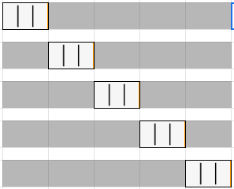

[https://towardsdatascience.com/understanding-8-types-of-cross-validation-80c935a4976d]()
# **8 типов перекрестной проверки**
## Подробное объяснение перекрестной проверки и ее типов
**Перекрестная проверка (кросс-проверка, скользящий контроль, англ. cross-validation),** является важным элементом проекта по науке о данных. Это процедура повторной выборки, используемая для оценки моделей машинного обучения и определения того, как модель будет работать для независимого тестового набора данных.

В этой статье вы можете прочитать о 8 различных методах перекрестной проверки, имеющих свои плюсы и минусы, перечисленные ниже:

1. ***Перекрестная проверка с p-out исключением (***Leave p-out cross-validation***)***
1. ***Перекрестная проверка без исключения (Leave-one-out)***
1. ***Перекрестная проверка с удержанием***
1. ***Повторная проверка случайной подвыборки***
1. ***k-кратная (k-fold) перекрестная проверка***
1. ***Стратифицированная k-кратная (Stratified k-fold) перекрестная проверка***
1. ***Перекрестная проверка временных рядов***
1. ***Вложенная перекрестная проверка***

Прежде чем переходить к методам перекрестной проверки, дайте нам знать, почему перекрестная проверка должна использоваться в проекте по науке о данных.
## Почему важна перекрестная проверка?
Мы часто случайным образом разделяем набор данных на обучающие и тестовые данные, чтобы разработать модель машинного обучения. Обучающие данные (training data) используются для обучения модели машинного обучения, и затем та же модель тестируется на независимых тестовых данных (testing data) для оценки эффективности выбранной модели.

С изменением случайного состояния разбиения точность модели также меняется, поэтому мы не можем достичь фиксированной точности для модели. Данные тестирования должны храниться независимо от данных обучения, чтобы не произошло утечки данных. Во время разработки модели машинного обучения с использованием обучающих данных необходимо оценить эффективность модели. Здесь становится очевидным важность данных перекрестной проверки.

Данные необходимо разделить на:

- **Данные обучения (training data):** используются для разработки/обучения модели.
- **Данные проверки (validation):** используются для проверки эффективности той же модели.

(Изображение автора), разделение валидации

Проще говоря, перекрестная проверка позволяет нам еще лучше использовать наши данные. Вы можете дополнительно прочитать, изучить и реализовать 7 типов методов перекрестной проверки.
# 1. 1.	Перекрестная проверка с p-out исключением (Leave p-out):
Перекрестная проверка с  p-out исключением (Leave p-out cross-validation - LpOCV) - это метод исчерпывающей перекрестной проверки (validation data), который включает использование p-наблюдения в качестве данных проверки, а оставшиеся данные используются для обучения модели. Это повторяется всеми способами, чтобы нарезать исходную выборку на проверочный набор из *p* наблюдений (validation) и на обучающий набор (training).

Вариант LpOCV с p = 2, известный как перекрестная проверка исключения-пары (leave-pair-out), был рекомендован как почти беспристрастный метод для оценки площади под [кривой ROC](https://en.wikipedia.org/wiki/ROC_curve) бинарного классификатора.
# 2. Перекрестная проверка без исключения (Leave-one-out) :
Перекрестная проверка без исключения (LOOCV) - это исчерпывающий метод перекрестной проверки. Это категория LpOCV со случаем p = 1.

( [Источник](https://en.wikipedia.org/wiki/File:LOOCV.gif) ), операции LOOCV

Для набора данных, содержащего n строк, первая строка выбирается для проверки, а остальные (n-1) строки используются для обучения модели. Для следующей итерации выбирается 2-я строка для проверки, а оставшиеся для обучения модели. Точно так же процесс повторяется до n шагов или желаемого количества операций.

Оба вышеупомянутых метода перекрестной проверки являются типами исчерпывающей перекрестной проверки. Методы исчерпывающей перекрестной проверки - это методы перекрестной проверки, которые учатся и тестируются всеми возможными способами. У них есть те же плюсы и минусы, о которых говорится ниже:
## Плюсы:
1. Просто, легко понять и реализовать.
## Минусы:
1. Модель может привести к низкому смещению (low bias).
1. Требуемое время вычислений велико.
# 3. Перекрестная проверка с удержанием (Holdout):
Метод удержания - это метод исчерпывающей перекрестной проверки, который случайным образом разбивает набор данных на обучающие и тестовые данные в зависимости от анализа данных.

(Изображение автора), 70:30 разделение данных на данные для обучения и проверки соответственно

В случае перекрестной проверки удержания набор данных случайным образом разделяется на данные обучения и проверки. Как правило, разделение обучающих данных - это не просто тестовые данные. Обучающие данные используются для создания модели, а данные проверки оценивают эффективность модели.

Чем больше данных используется для обучения модели, тем она лучше. Для метода перекрестной проверки удержания большой объем данных изолирован от обучения.
## Плюсы:
1. То же, что и предыдущий.
## Минусы:
1. Не подходит для несбалансированного набора данных.
1. Многие данные изолированы от обучения модели.
# 4. k-кратная (k-fold) перекрестная проверка:
При k-кратной перекрестной проверке исходный набор данных в равной степени делится на k частей или фолдеров. Из k-кратных групп для каждой итерации одна группа выбирается в качестве данных проверки (validation), а оставшиеся (k-1) группы выбираются в качестве данных обучения.

( [Источник](https://en.wikipedia.org/wiki/File:KfoldCV.gif) ), k-кратная перекрестная проверка

Процесс повторяется k раз, пока каждая группа не будет обработана как проверочная (validation) и оставшиеся в качестве обучающих (training) данных.

(Изображение автора), k-кратная перекрестная проверка

Окончательная точность модели вычисляется путем взятия средней точности данных валидации k-моделей.

LOOCV - это вариант k-кратной перекрестной проверки, где k = n.
## Плюсы:
1. Модель имеет низкое смещение (low bias)
1. Низкая время обучения
1. Весь набор данных используется как для обучения, так и для проверки.
## Минусы:
1. Не подходит для несбалансированного набора данных.
# 5. Повторная проверка случайной подвыборки:
Повторная случайная проверка подвыборки, также называемая перекрестной проверкой Монте-Карло, случайным образом разбивает набор данных на обучение и проверку. Маловероятно k-кратное разбиение набора данных при перекрестной проверке не на группы, а разбивается в этом случае случайным образом.

Количество итераций не фиксировано и определяется путем анализа. Затем результаты усредняются по разбиениям.

(Изображение автора), Повторная проверка случайной подвыборки

## Плюсы:
1. Соотношение разделений на обучение и проверку не зависит от количества итераций или разделов.
## Минусы:
1. Некоторые образцы могут быть пропущены и не использоваться ни для обучения, ни для проверки.
1. Не подходит для несбалансированного набора данных.
# 6. Стратифицированная k-кратная перекрестная проверка:
Для всех методов перекрестной проверки, описанных выше, они могут не работать с несбалансированным набором данных. Стратифицированная k-кратная перекрестная проверка решила проблему несбалансированного набора данных.

При стратифицированной k-кратной перекрестной проверке набор данных разбивается на k групп или фолдеров, так что проверочные данные (validation) имеют равное количество экземпляров метки целевого класса. Это гарантирует, что ни один конкретный класс не будет превалировать ни в данных проверки, ни в данных обучения, особенно когда набор данных несбалансирован.

(Изображение автора), стратифицированная k-кратная перекрестная проверка, каждая кратность имеет равные экземпляры целевого класса

Окончательная оценка рассчитывается как среднее значение по каждой группе.
## Плюсы:
1. Хорошо работает для несбалансированного набора данных.
## Минусы:
1. Не подходит для набора данных временных рядов.
# 7. Перекрестная проверка временных рядов:
Порядок данных очень важен для задач, связанных с временными рядами. Для набора данных с привязкой ко времени случайное разбиение или k-кратное разбиение данных на обучающий (training) и проверочный (validation) наборы могут не дать хороших результатов.

Для набора данных временных рядов разделение данных на обучающий и проверочный наборы в соответствии со временем также называется **методом прямой цепочки (forward chaining method)** или **скользящей перекрестной проверкой** (**rolling cross-validation**). Для конкретной итерации следующий экземпляр обучающих (training) данных можно рассматривать как проверочные (validation) данные.

(Изображение автора), перекрестная проверка временных рядов

Как упомянуто на приведенной выше диаграмме, для 1-й итерации первые 3 строки считаются обучающими (training) данными, а следующий экземпляр T4 - данными проверки (validation). Возможность выбора обучающих и проверочных данных направляется для дальнейших итераций.
# 8. Вложенная перекрестная проверка:
В случае k-кратной и стратифицированной k-кратной перекрестной проверки мы получаем слабую оценку ошибки в обучающих и тестовых данных. В более ранних методах настройка гиперпараметров выполняется отдельно. Когда перекрестная проверка используется одновременно для настройки гиперпараметров и обобщения оценки ошибки, требуется вложенная перекрестная проверка.

Вложенная перекрестная проверка может применяться как в k-кратном, так и в стратифицированном k-кратном вариантах. Прочтите статью ниже, чтобы узнать больше о вложенной перекрестной проверке и ее реализации:

##
###

[**Вложенная перекрестная проверка для машинного обучения с Python - мастерство машинного обученияK-кратная процедура перекрестной проверки используется для оценки производительности моделей машинного обучения при создании…**machinelearningmastery.com](https://machinelearningmastery.com/nested-cross-validation-for-machine-learning-with-python/)
# Заключение:
Перекрестная проверка используется для сравнения и оценки производительности моделей машинного обучения. В этой статье мы рассмотрели 8 методов перекрестной проверки, а также их плюсы и минусы. k-кратная и стратифицированная k-кратная перекрестная проверка являются наиболее используемыми методами. Перекрестная проверка временных рядов лучше всего работает с проблемами, связанными с временными рядами.

Реализацию этих перекрестных проверок можно найти в пакете sklearn. Прочтите [эту документацию](https://scikit-learn.org/stable/modules/cross_validation.html) по [sklearn](https://scikit-learn.org/stable/modules/cross_validation.html) для получения более подробной информации.
# Использованная литература:
[1] Википедия: <https://en.wikipedia.org/wiki/Cross-validation_(statistics)>

